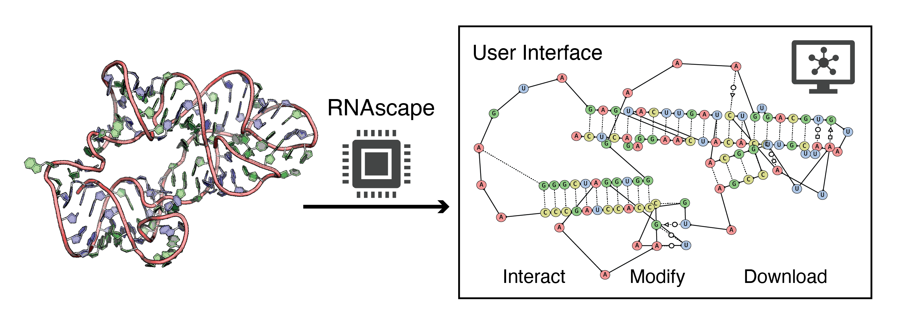

# RNAscape
### Geometric mapping and interactive visualization of RNA structure

### Getting Started
1. Ensure Python 3.9+ is installed and clone the repository
2. Run `pip install -r requirements.txt`
3. Get x3dna-dssr and update `X3DNA_PATH` in `run_rnascape.py`
4. Run `run_rnascape.py <FILEPATH> <PREFIX>` (ex:`python run_rnascape.py 1ivs.cif 1ivs`)
5. Edit `run_rnascape.py` to change base pair annotation, rotation, and other features
6. Default output is in `./output/processed_images/`
